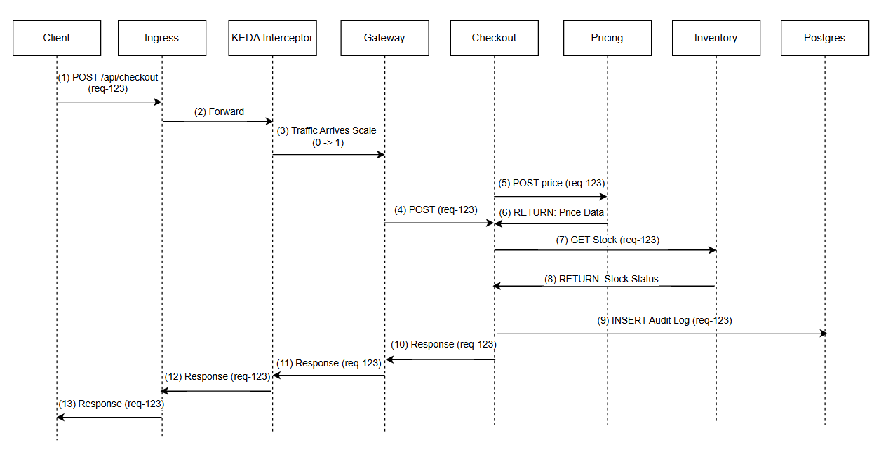

# Kubernetes Nanoservices Checkout System

A nanoservices-based checkout system deployed on Kubernetes (K3s). This project demonstrates service-to-service communication, request tracing, autoscaling using KEDA, failure handling, debugging workflows, and persistence using PostgreSQL.

## Overview

This system simulates an e-commerce checkout workflow composed of multiple independent services:

- Gateway – Entry point for all client requests
- Checkout – Core business logic 
- Pricing – Calculates totals and tax
- Inventory – Validates stock availability
- PostgreSQL – Persistent data storage

The application is deployed on Kubernetes and exposed externally via Ingress (Traefik). 
## Architecture

### System Architecture:

               [ Browser / curl ]
                       |
                       v
              [ Ingress (Traefik) ] 
                       |
                       v
         [ KEDA HTTP Interceptor Proxy ]  
                       |
                       v
          [ gateway-svc (NGINX / UI) ]  
                       |
                       v
                [ checkout-svc ]  
                       |
         ┌─────────────┼─────────────┐
         │             │             │
         v             v             v
  [ pricing-svc ] [ inventory-svc ] [ postgres-svc ]
   (Get Price)      (Check Stock)      (Audit Log)

### Request Flow:

- Gateway routes external traffic into the cluster
- Checkout composes responses by calling dependent services
- Internal communication uses Kubernetes DNS and ClusterIP services
- Ingress provides a unified external entry point

## Key Features

### Microservices Architecture
- Services are independently deployed and managed
- Communication occurs over HTTP using internal DNS
- Demonstrates nanoservice-style composition

### API Endpoints
Gateway exposes:

- GET / – UI entry point
- GET /api/ping – Health and latency testing
- GET /api/arch – Architecture label for observability
- POST /api/checkout – Main checkout workflow

Checkout internally calls:

- Pricing service (total calculation)
- Inventory service (stock validation)

### Request Tracing

- Each request carries an X-Request-ID header
- The ID is propagated across all services
- Logs include request IDs for end-to-end tracing
- Enables easier debugging in distributed environments

### KEDA Scaling
- Gateway configured for scale-to-zero behaviour
- Automatically scales up when traffic arrives
- Scales down during idle periods

### Failure Handling
- Checkout uses timeouts for dependent services
- Handles partial failures gracefully
- Returns clear error responses (e.g., dependency unavailable, out-of-stock)
- Gateway remains available even when backend services fail

### Testing and Reliability

The system was tested under multiple conditions:

- Happy path – Successful checkout flow
- Out-of-stock scenario – Inventory validation failure
- Invalid input handling – Proper validation responses
- Bad rollout simulation – Incorrect image leading to failure
- Dependency failure – Service unavailability handling
- Recovery testing – System restored after fixes

### Persistence (PostgreSQL)
- PostgreSQL deployed on Kubernetes
- Uses Persistent Volume Claim (PVC) for storage
- Data persists across pod restarts
- Credentials managed securely via Secrets

## What This Project Demonstrates

- Nanoservices design on Kubernetes
- Service-to-service communication using DNS
- Request tracing across distributed services
- Handling partial failures and timeouts
- Autoscaling with KEDA (including scale-to-zero)
- Troubleshooting using Kubernetes-native tools
- Persistent storage using PostgreSQL and PVCs
- Real-world deployment patterns (Ingress, Services, Deployments)
